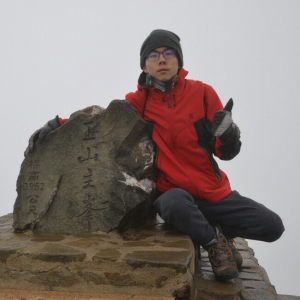

<!--[GitHub](https://github.com/yslan/) -->
<!--[Google Scholar](https://scholar.google.com/citations?user=Hfzrm8EAAAAJ&hl) -->
<!--[LinkedIn](https://www.linkedin.com/in/yuhsianglan/) -->

> **TODO**: Add pics / showcase
> 

{: width="300" height="300" .left}
<!---{:.w-50 .left}-->

I am Yu-Hsiang Lan (First name: Yu-Hsiang, Last name: Lan[^tw-name]), or 藍鈺翔 in Taiwanese Mandarin, born and raised in Taiwan.    

My master's research at National Taiwan University (NTU) was my first venture in the field of numerical PDEs. 
Later, I was lucky to have been invited to Argonne National Laboratory (ANL) as a summer student. It was my first high-performance computing (HPC) experience and I enjoyed it a lot. 
After getting my master degree in applied math, I had been continually working at Argonne as a pre-doctoral appointee for three years. 
Now, I'm back to school and currently being a computer science master student at University of Illinois working toward a doctoral degree.

[^tw-name]: [Ref: Taiwanese naming and spelling in English](https://culturalatlas.sbs.com.au/taiwanese-culture/taiwanese-culture-naming)

---

## Education

- M.S., Computer Science, Unerversity of Illinois Urbana Champaign, 2021 -- present
- M.S., Applied Mathematics, Naitonal Taiwan University, 2018
- B.S., Mathematics, Naitonal Taiwan University, 2016

## Employment

- Research Assistant, University of Illinois, 2021-current
- Predoctoral Appointee, Argonne National Laboratory, 2018-2021
- Summer Internship, Argonne National Laboratory, 2017, 2018, and 2022

## Research Interests

My current research is centered on Nek5000/NekRS[^nek5000]. 

- High-Order Methods for Numerical Partial Differential Equations
   - Incompressible Navier-Stokes (NS), Reynolds-Averaged Navier-Stokes (RANS)
   - Poisson-Nernst-Planck (PNP)
   - Steady state solver with Jacobian-free Newton Krylov (JFNK) method.
   - Preconditioner with domain decomposition and multigrid methods.
- High-Order Mesh Generation
  - Voronoi cell based all-hex meshing algorithms for dense-packed spheres
  - Mesh smoothing and optimization
- High-Performance Computing
   - Large-scale simulations on top 10 supercomputers including CPUs and GPUs 
<!--   - ALCF: Mira, Theta/ThetaGPU, Polaris    -->
<!--   - OLCF: Titan, Summit, Crusher           -->
<!--   - NERSC: Perlmutter                      -->
<!--   - NCSA: Delta                            -->   
- NekCEM/Nek5000/NekRS user, developer, and forum contributor

[^nek5000]: [Nek5000](https://nek5000.mcs.anl.gov) is an efficient scalable open source computational fluid dynamics (CFD) solver using spectral element method (SEM) and [NekRS](https://github.com/Nek5000/NekRS) is its GPU variant. They both target large scale turbulence simulations on supercomputers.

