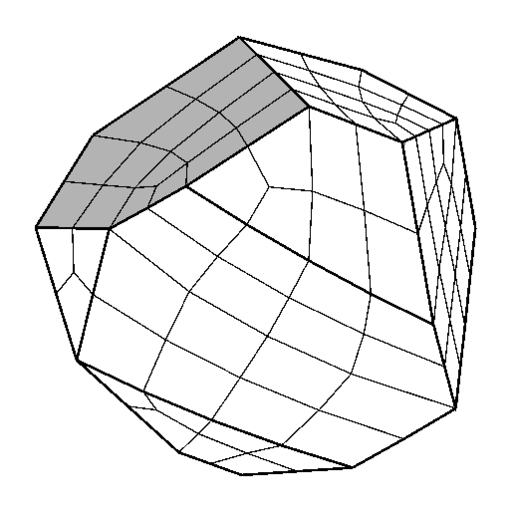

<!---## Research Interests--->

<!------>

> **TODO**: Add showcase in posts
> 

I'm interested in Numerical PDE methods, mostly focusing on aspects related to spectral element method, with the aide of high-performance computing. 
My current research is centered on Nek5000/NekRS[^nek5000], working with ECP/CEED[^ceed] project. 

- High-Order Methods for Numerical Partial Differential Equations
   - Incompressible Navier-Stokes (NS), Reynolds-Averaged Navier-Stokes (RANS)
   - Poisson-Nernst-Planck (PNP)
   - Steady state solver with Jacobian-free Newton Krylov (JFNK) method.
   - Preconditioner with domain decomposition and multigrid methods.

<!-- {: width="200" height="200" .right}-->
<!-- {: width="200" height="200" .right}-->

- High-Order Mesh Generation
  - Voronoi cell based all-hex meshing algorithms for dense-packed spheres
  - Mesh smoothing and optimization

  {: width="151.2"}
  {: width="156.6"}
  {: width="288"}

- High-Performance Computing
   - Large-scale simulations on top 10 supercomputers including CPUs and GPUs 
<!--   - ALCF: Mira, Theta/ThetaGPU, Polaris    -->
<!--   - OLCF: Titan, Summit, Crusher           -->
<!--   - NERSC: Perlmutter                      -->
<!--   - NCSA: Delta                            -->   
- NekCEM/Nek5000/NekRS user, developer, and forum contributor

---
[^nek5000]: [Nek5000](https://nek5000.mcs.anl.gov) is an efficient scalable open source computational fluid dynamics (CFD) solver using spectral element method (SEM) and [NekRS](https://github.com/Nek5000/NekRS) is its GPU variant. They both target large scale high fidelity turbulence simulations on supercomputers.

[^ceed]: Center for Efficient Exascale Discretizations [[Website](https://ceed.exascaleproject.org)]

